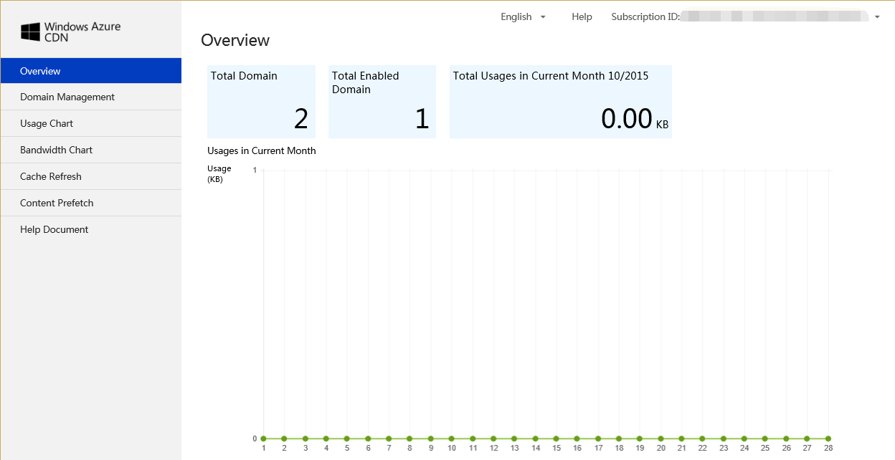
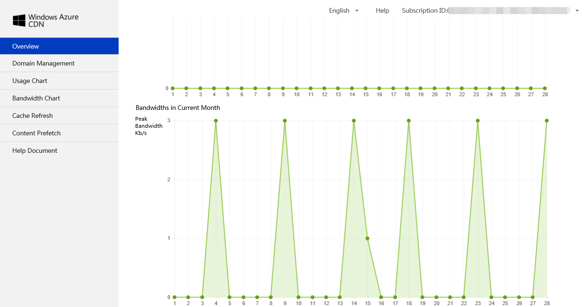
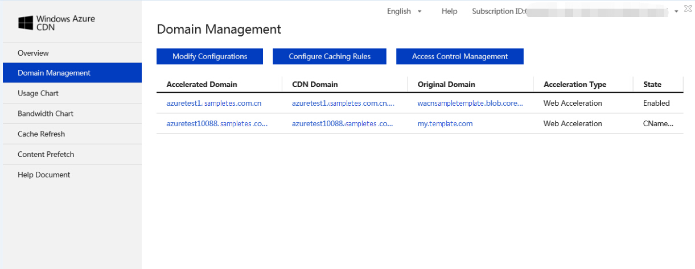
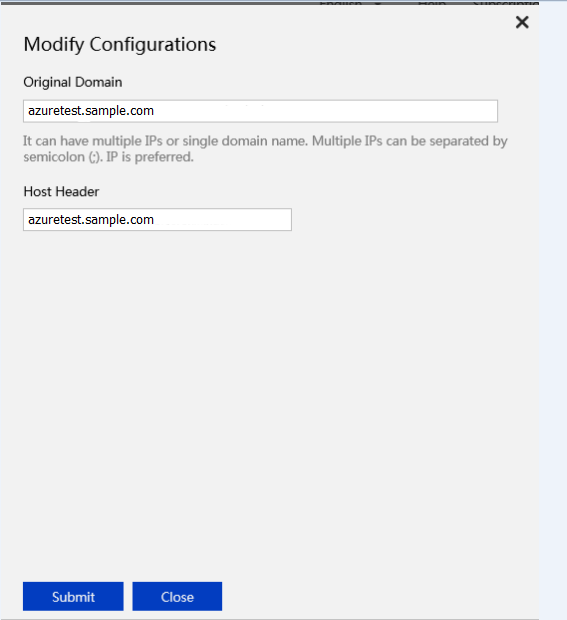
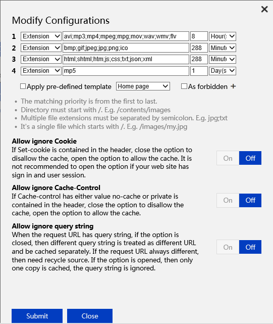
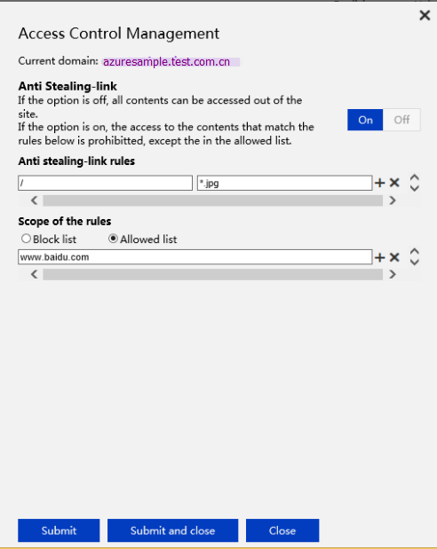
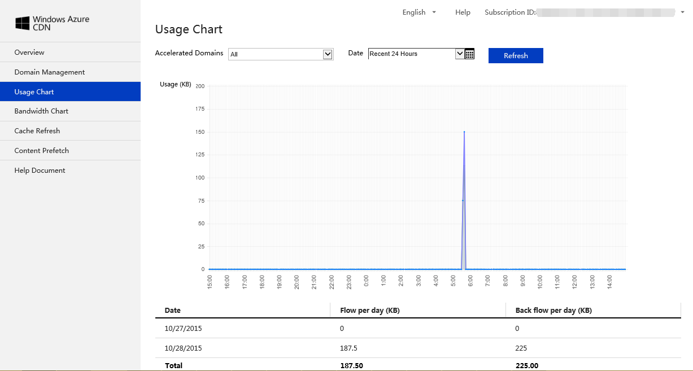
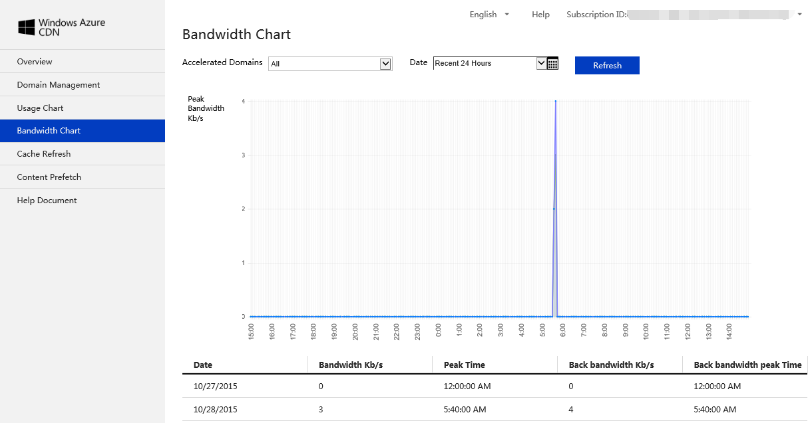
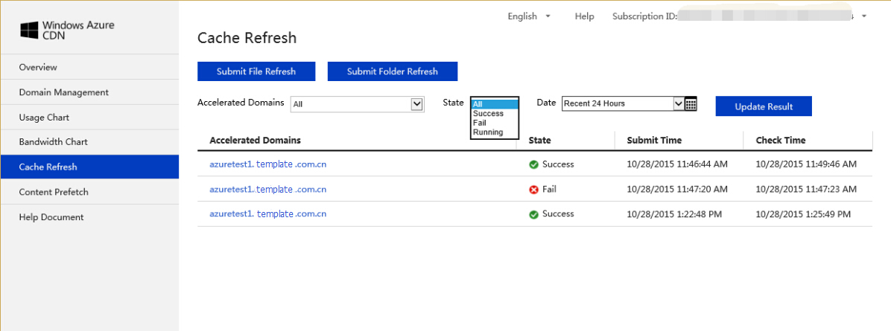
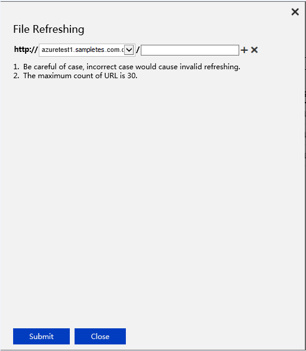

#China Azure CDN
The Windows Azure Content Delivery Network (CDN) caches Windows Azure blobs and static content used by cloud services at strategically placed locations across China to provide maximum bandwidth for delivering content to users. China Azure CDN also support origin domains that are not deployed on Azure platform.

You can create a CDN endpoint for a storage account, in order to cache blob data, or for a cloud service, in order to cache static content used by the service. When you create the endpoint, you must provide your custom domain and related ICP number. The Windows Azure Management Portal provides you with a unique URL for accessing your cached content, but you need to create a CNAME resource record with your DNS provider that points from your custom domain to this URL. This URL maps to the origin domain, which is the storage account or cloud service on which you created the endpoint. 

##Create CDN Endpoint

1.	Go to Windows Azure CDN, choose CDN and click ‘NEW’’, Click QUICK CREATE.
2.	Choose ‘Acceleration Type’, currently China Azure CDN support Web Acceleration, Download Acceleration and VOD Acceleration. 
3.	Choose ‘Origin Domain Type’, currently we have support 4 options, Cloud Service, Storage Account, Web App and Custom Origin Domain
4.	Type in or choose Origin Domain, select an origin domain under selected Origin Domain Type in last step.
5.	In ‘Custom Domain’, type the custom domain you are about to use.
6.	For ‘ICP Number’, type in the mapping ICP number with above custom domain. 
	

Note: It may take 1 business day to verify if ICP number and custom domain match.

##View CDN Endpoint Details
###Endpoint General Information
Once creating an endpoint, you can click it and view general info, see details below.

###Monitor
Use the CDN Endpoint monitoring work space to view the bandwidth history for your CDN Endpoint. The CDN Endpoint monitoring work space displays the following parameters:Bandwidth – The bandwidth of data received from CDN Endpoint. Use the controls at top right to select Relative or Absolute display, and to specify a 1-hour, 24-hour, or 7-day time scale. Note that you must click the refresh button to change the display.

###Disable or Delete CDN Endpoint
To stop caching content on a CDN endpoint, you can disable the endpoint. When the endpoint is disabled, content cached by the CDN on that endpoint is not available to users, and the application will need to provide that content from the origin domain, until the endpoint is enabled again.
If you wish to stop caching content on the endpoint altogether, you can delete the endpoint.

###Advanced Management

If you wish to do advanced CDN configurations and/or view reporting, you can click the “manage” button and will be redirected to another website to manage those activities.

####Overview
In Advance management page, you will see overview of then endpoints you created under selected subscription ID. Total Domain, Total Enabled Domain, Total Usage in Current Month and Bandwidths in Current Months.

####Domain Management
You can see all the domains list created under selected subscription ID.
You can Modify Configurations, Configure Caching Rules and Access Control Management.

####Modify Origin Domain
Windows Azure CDN has default caching rules. You can also customize caching rules and system will apply customized rules. If doesn’t hit customized rules, it will apply default caching rules.

####Modify caching rules
- Folder caching rules: Folder must begin with ‘/’, e.g. "/pic", "/doc", "/htdoc/data", caching rules will apply to all sub folders.
- File caching rules: Use common suffix, e.g. "jpg", "png", "gif", "txt", "m4v", "mp3", caching rules will apply to all files with set suffix under specified folder.
- Caching order: Caching rules follow first-set, first apply. 

####Access Control Management
Can configure Referer Block list and allowed list to achieve anti-stealing link.
Each rule applies to both folder and files. E.g. all png files under /*.png.
Block list: when Referer is in block list, access is denied. Otherwise can do.
Allow list: only when Referer is in allow list, access is allowed. Otherwise, access denied.

####Usage Chart
Select Subscription ID, acceleration domains and date to view chargable usage.

####Bandwidth Usage
Select Subscription ID, acceleration domains and date to view bandwidth usage.

####Cache Refresh
Select Subscription ID, acceleration domains and date to view Cache states. The states has 3 values, Success, Fail and Running. You can also configure cache refresh rules, File Refresh and Folder Refresh. 

####File refresh
You can click Submit File Refresh to set File Refreshing rule. Can click ‘+’ to add rules and ‘X’ to delete rules.

####Folder Refresh
Submit Folder Refresh to set folder refresh rules. Can click ‘+’ to add rules and ‘X’ to delete rules.

####Content Prefetch
You can select Subscription ID, Acceleration Domains and Date to view content prefetch per your request. It has 3 states: Success, Fail and Running.

Can click Submit Prefetch to set rules to prefetch contents, this applies to large file distribution and reduces response time when user access contents the first time.

