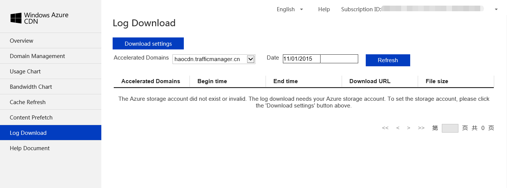
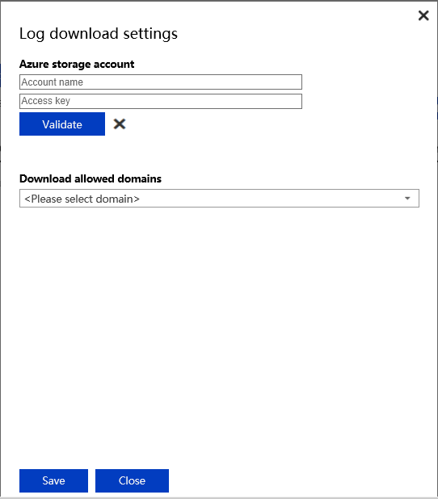

#Log Download
Click on "Log Download" on left navigation panel to download logs for selected domains.

##Log Download View
To be able to store CDN logs, you need an Azure Storage Account. Please click on "Download settings" to set your storage account.

##Download Settings View
In this view, you can set your Azure storage account and select domains that you want to download logs for. After validation, all log files will be stored with above storage account. You can remove the storage account to disable log download. 

##Log Format
Logs are stored as blobs under the container named "cdn-access-logs" and each blob is a Gzipped CSV file. See details below:

 - c-ip: client IP address
 - timestamp: access time
 - cs-method: HTTP requested actions, e.g.GET method.
 - cs-uri-stem: the Universal Resource Identifier, or target, of the action.
 - http-ver: HTTP protocol version
 - sc-status: Protocol Status, the HTTP or FTP status code.
 - sc-bytes: the number of bytes that the server sent. 
 - c-referer: client referer
 - c-user-agent: client user agent
 - rs-durations(ms): request time (ms)
 - hit-miss: CDN cache hit/miss ID
 - s-ip: Server IP Address, the IP address of the server on which the log file entry was generated.

**Note** Those empty fields will be set to "-", e.g. "c-referer". Also, depending on edge server settings, "rs-duration","hit-miss","s-ip"　may also be empty.

**Note** After CDN is enabled, most page visits are from CDN edge servers.The real client IP address is recorded in the HTTP header **X-FOrwarded For**. Please adjust the log configuration of your web server if you need this information. Here is an example for Nginx:

