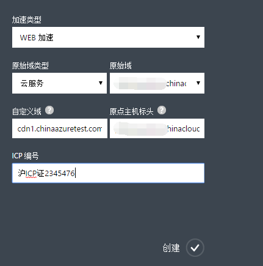
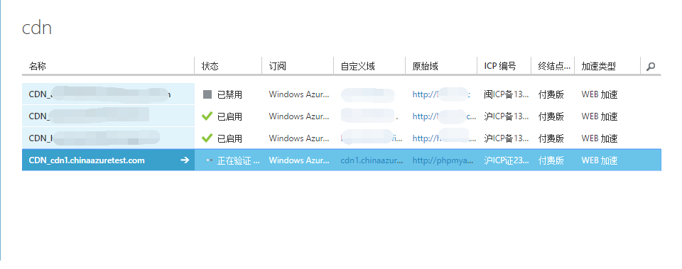

#Web类型CDN节点创建
WEB类型加速是将源站的网页内容，如html文件，CSS，图片，JS，flash动画等更新频率低的文件缓存到Windows Azure CDN的边缘节点，满足用户就近访问网站的需求，提高网页访问体验。文件可以通过自定义缓存规则或者手动刷新CDN缓存文件。

本文是针对Web类型加速域名创建，您也可以参考[使用Windows Azure CDN](http://www.windowsazure.cn/documentation/articles/cdn-how-to-use/)了解Windows Azure CDN加速节点创建信息。

###**创建Web类型加速域名**

1. 在 Windows Azure 管理门户的导航窗格中，单击“CDN”。
2. 在功能区上，单击“新建”。在“新建”对话框上，依次选择“应用服务”、“CDN”和“快速创建”。
   
3. 在“订阅”下拉列表中选择所要使用的Azure 订阅（如果有多个订阅的话）。
4. 在“加速类型”下拉列表中选择“WEB加速”。
5. 在“原始域类型”下拉列表中，选择云服务，存储账户，WEB应用，或者自定义原始域。**注意**“WEB加速”不支持“媒体服务”原始域类型。
6. 在“原始域”下拉列表中，从可用的云服务，存储帐户，或者WEB应用列表中选择一个用于创建CDN终结点。
   

    如果“原始域类型”选择的是“自定义原始域”，那么请在“原始域”里输入您自己的原始域地址。您可以填写一个或者多个原始域ip地址，多个请以“;”分隔，如“126.1.1.1;172.1.1.1），或者原始域名，如origin.chinaazuretest.com。
7. 在“自定义域”中输入要使用的自定义域名如：cdn.chinaazuretest.com。自定义域支持泛域名加速。
8. 在“原点主机标头（origin host header）”中输入您的源站所接受的回源访问host header。当您输入完“自定义域”之后，系统会根据您所选择的“原始域类型”来自动填充一个默认值。具体的规则是，如果您的源站是在Azure上的话，默认值就是相应的源站地址。如果您的源站不在Azure上，默认值是您输入的“自定义域名”，当然您也可以根据自己源站的实际配置情况来修改。
   
9. 在“ICP编号”中输入和上一步中所输入的自定义域名相对应的ICP备案号（如：京ICP备XXXXXXXX号-X）。
10. 单击“创建”按钮以创建新的终结点。

终结点创建后将出现在订阅的终结点的列表中。列表视图显示了用于访问缓存内容的自定义域以及原始域。
原始域是 CDN 所缓存内容的原始位置。自定义域是用于访问CDN缓存内容的URL。

   

**注意** 为终结点创建的配置将不能立即可用：

- 首先需要审核所提供的自定义域名和ICP编号是否匹配、有效。这个过程需要最多一个工作日的时间来完成。
- 如果ICP审核没有通过，您需要删除之前创建的这个CDN终结点，然后使用正确的自定义域名和ICP编号重新创建。
- 如果ICP审核通过，CDN服务最多需要 60 分钟时间进行注册以便通过 CDN 网络传播。与此同时，您还需要按照界面上的提示信息配置CNAME映射信息，这样才可以最终通过自定义域名访问CDN缓存内容。

###**Web类型加速默认缓存规则**

1. 对php、aspx、asp、 jsp、 do、 dwr、cgi、 fcgi、action、ashx、axd、json等动态文件不缓存
2. 对以shtml、html、htm、js结尾的文件，默认缓存半天（720分钟） 
3. 其他静态文件默认缓存一天（1440分钟）